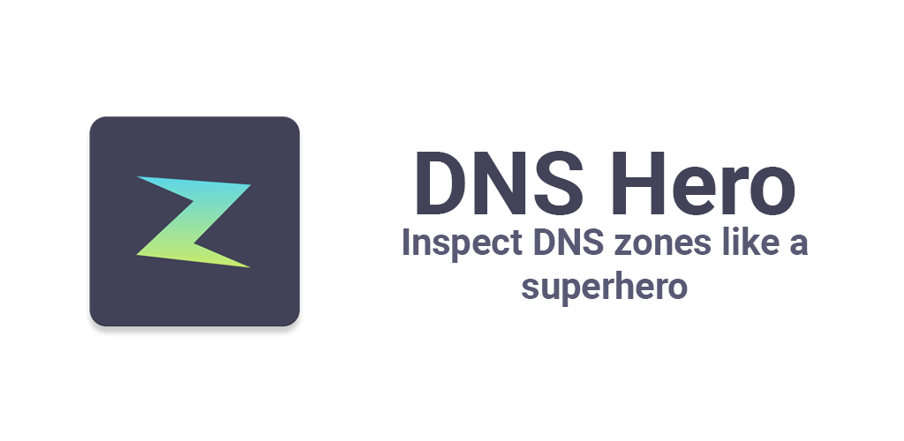

<h1 align=center>

</h1>


[](https://crowdin.com/project/dnshero)
[](https://app.codacy.com/gh/devgianlu/DNSHero/dashboard?utm_source=gh&utm_medium=referral&utm_content=&utm_campaign=Badge_grade)
[](https://wakatime.com/badge/github/devgianlu/DNSHero)

An Android app to inspect DNS zones like a superhero.

<div style='float:left'>
<a href='https://play.google.com/store/apps/details?id=com.gianlu.dnshero&pcampaignid=MKT-Other-global-all-co-prtnr-py-PartBadge-Mar2515-1'></a>
<a href='https://f-droid.org/app/com.gianlu.dnshero'></a>
</div>


## Setup
This project uses [devgianlu/CommonUtils](https://github.com/devgianlu/CommonUtils), please follow the link to setup your environment properly.


## LICENSE

```
Copyright (C) <year> <name of author>

This program is free software: you can redistribute it and/or modify it under the terms of the GNU General Public License as published by the Free Software Foundation, version 3.

This program is distributed in the hope that it will be useful, but WITHOUT ANY WARRANTY; without even the implied warranty of MERCHANTABILITY or FITNESS FOR A PARTICULAR PURPOSE. See the GNU General Public License for more details.

You should have received a copy of the GNU General Public License along with this program. If not, see <https://www.gnu.org/licenses/>.
```
